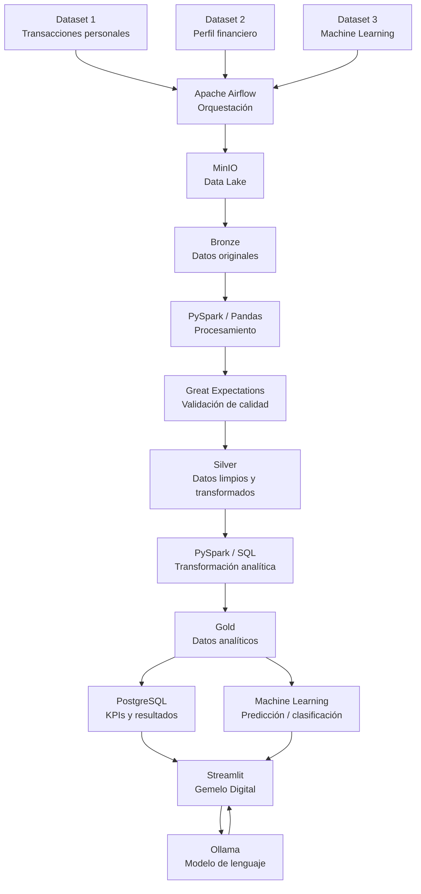
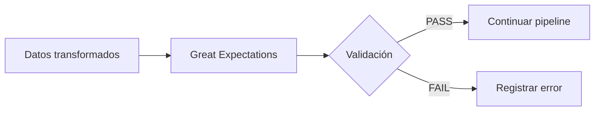
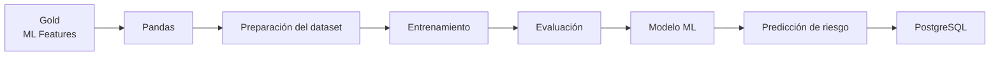
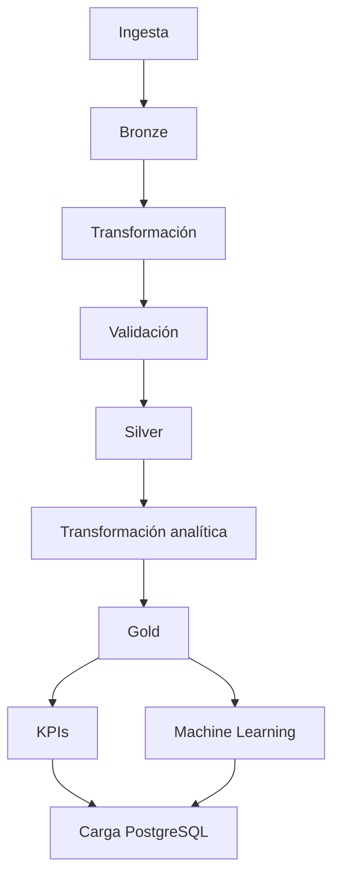

# Arquitectura del Proyecto
## Gemelo Digital Financiero Personal

## 1. Objetivo de la arquitectura

La arquitectura tiene como objetivo establecer una plataforma de datos reproducible, escalable y trazable para el desarrollo de un Gemelo Digital Financiero Personal.

La solución integrará tres datasets relacionados con finanzas personales y los procesará mediante una arquitectura de datos basada en las capas Bronze, Silver y Gold. Los datos serán almacenados en MinIO, procesados mediante PySpark y Pandas, validados mediante Great Expectations y orquestados mediante Apache Airflow.

La información procesada alimentará indicadores financieros, procesos de Machine Learning y un modelo de lenguaje ejecutado localmente mediante Ollama. Finalmente, Streamlit proporcionará la interfaz de interacción con el usuario.

---

## 2. Arquitectura general



---

## 3. Flujo de datos

El flujo de datos comienza con la incorporación de los tres datasets seleccionados. Apache Airflow será responsable de orquestar las diferentes etapas del pipeline.

Los datos originales se almacenarán en la capa Bronze dentro de MinIO. Esta capa conservará los datos en su estado original para mantener trazabilidad y permitir su reprocesamiento.

Posteriormente, PySpark y Pandas realizarán las operaciones de limpieza y transformación. Great Expectations validará la calidad de los datos antes de permitir su incorporación a la capa Silver.

La capa Silver contendrá datos limpios, estandarizados y estructurados. A partir de esta información se generará la capa Gold, orientada al análisis, generación de KPIs y preparación de características para Machine Learning.

Los resultados analíticos podrán almacenarse en PostgreSQL para facilitar su consulta desde la aplicación Streamlit.

El modelo de Machine Learning utilizará los datos preparados en Gold para generar predicciones o clasificaciones relacionadas con el riesgo financiero. Ollama será utilizado como componente de lenguaje para interpretar la información financiera disponible y generar respuestas comprensibles para el usuario.

---

## 4. Capas de datos

### 4.1 Bronze

La capa Bronze almacena los datos originales provenientes de las fuentes de información.

Características:

- Conservación de los datos originales.
- Mínima transformación.
- Trazabilidad del origen.
- Registro de fecha de ingestión.
- Identificación de la ejecución del pipeline.
- Posibilidad de reprocesamiento.

Estructura propuesta:

```text
bronze/
├── transactions/
├── financial_profile/
└── ml/
```

---

### 4.2 Silver

La capa Silver contiene información limpia, validada y transformada.

En esta capa se realizarán procesos como:

- Conversión de tipos de datos.
- Tratamiento de valores nulos.
- Eliminación de duplicados.
- Normalización de nombres.
- Validación de rangos.
- Estandarización de categorías.
- Integración de información relacionada.

Great Expectations será utilizado para verificar las reglas de calidad antes de considerar los datos como aptos para análisis.

Estructura propuesta:

```text
silver/
├── transactions/
├── financial_profile/
└── ml/
```

---

### 4.3 Gold

La capa Gold contiene información preparada para consumo analítico, generación de indicadores y Machine Learning.

Estructura propuesta:

```text
gold/
├── financial_kpis/
├── user_financial_profile/
├── credit_risk_features/
└── ml_features/
```

Los datos de esta capa podrán ser utilizados por:

- Streamlit.
- PostgreSQL.
- Modelos de Machine Learning.
- Procesos de análisis financiero.
- Sistema de recomendaciones.

---

## 5. Componentes tecnológicos

| Tecnología | Responsabilidad |
|---|---|
| Docker | Contenerización y reproducibilidad del entorno |
| Apache Airflow | Orquestación de pipelines |
| MinIO | Almacenamiento de objetos y Data Lake |
| Delta Lake / Parquet | Formato de almacenamiento |
| PySpark | Procesamiento y transformación de datos |
| Pandas | Exploración y procesamiento de datos |
| Great Expectations | Validación y control de calidad |
| PostgreSQL | Almacenamiento relacional y consulta de resultados |
| Ollama | Ejecución local del modelo de lenguaje |
| Streamlit | Interfaz del Gemelo Digital |
| Git / GitHub | Control de versiones y documentación |

---

## 6. Arquitectura de almacenamiento

MinIO será utilizado como almacenamiento principal del Data Lake.

La información se organizará siguiendo el modelo:

```text
MinIO
│
├── Bronze
│   ├── transactions
│   ├── financial_profile
│   └── ml
│
├── Silver
│   ├── transactions
│   ├── financial_profile
│   └── ml
│
└── Gold
    ├── financial_kpis
    ├── user_financial_profile
    ├── credit_risk_features
    └── ml_features
```

### Delta Lake / Parquet

Se evaluará Delta Lake como formato principal para las capas del Data Lake. Delta Lake utiliza Parquet como formato de almacenamiento subyacente y permite incorporar capacidades adicionales de gestión de datos.

La elección definitiva del formato se documentará como una decisión arquitectónica independiente después de realizar las pruebas correspondientes.

---

## 7. Procesamiento

### PySpark

PySpark será utilizado principalmente para las transformaciones de datos que requieran procesamiento estructurado y operaciones sobre conjuntos de datos.

### Pandas

Pandas será utilizado principalmente para:

- Exploración inicial.
- Análisis descriptivo.
- Preparación de datos para Machine Learning.
- Operaciones de menor volumen.

La selección entre PySpark y Pandas dependerá del volumen y complejidad de cada operación.

---

## 8. Calidad de datos

Great Expectations será integrado al pipeline para validar la calidad de los datos.

Ejemplos de reglas:

```text
Edad
→ Debe encontrarse dentro de un rango válido.

Ingreso mensual
→ No debe ser negativo.

Gastos mensuales
→ No deben ser negativos.

Credit Score
→ Debe encontrarse dentro del rango definido por el dataset.

Registros
→ No deben contener duplicados cuando exista una clave única.
```

Flujo:



---

## 9. Machine Learning

El componente de Machine Learning utilizará las características preparadas en la capa Gold.

Flujo propuesto:



El modelo tendrá como finalidad apoyar el análisis del riesgo financiero del usuario y complementar los indicadores obtenidos mediante el procesamiento de datos.

---

## 10. Gemelo Digital Financiero

El Gemelo Digital Financiero será la capa de interacción con el usuario.

El sistema combinará:

1. Información financiera procesada.
2. KPIs.
3. Resultados del modelo de Machine Learning.
4. Simulaciones de decisiones financieras.
5. Modelo de lenguaje.

Ejemplo conceptual:

```text
Usuario
   │
   ▼
Streamlit
   │
   ├──► KPIs financieros
   │
   ├──► Perfil financiero
   │
   ├──► Riesgo financiero
   │
   └──► Simulación de compra
             │
             ▼
        Ollama / LLM
             │
             ▼
      Recomendación explicada
```

El modelo de lenguaje no será considerado sustituto del modelo de Machine Learning. El modelo de Machine Learning será responsable de generar resultados predictivos o clasificatorios, mientras que Ollama será utilizado para interpretar dichos resultados y facilitar la interacción mediante lenguaje natural.

---

## 11. PostgreSQL

PostgreSQL será utilizado como sistema de almacenamiento relacional para información que requiera consultas estructuradas y acceso frecuente desde la aplicación.

Entre las entidades potenciales se encuentran:

```text
financial_kpis
risk_scores
model_predictions
pipeline_runs
data_quality_results
```

El Data Lake en MinIO conservará los datos procesados, mientras que PostgreSQL funcionará como una capa relacional para resultados y metadatos seleccionados.

---

## 12. Orquestación

Apache Airflow será responsable de coordinar las diferentes etapas del procesamiento.

Flujo conceptual:



Las tareas serán organizadas mediante DAGs para permitir ejecuciones reproducibles y facilitar el monitoreo del pipeline.

---

## 13. Logs y métricas operativas

Cada ejecución del pipeline deberá generar información suficiente para determinar su estado y detectar problemas.

Métricas mínimas:

| Métrica | Descripción |
|---|---|
| `run_id` | Identificador único de ejecución |
| `pipeline_name` | Nombre del pipeline |
| `start_time` | Hora de inicio |
| `end_time` | Hora de finalización |
| `duration_seconds` | Duración |
| `records_read` | Registros leídos |
| `records_processed` | Registros procesados |
| `records_rejected` | Registros rechazados |
| `records_written` | Registros almacenados |
| `duplicate_records` | Duplicados detectados |
| `validation_passed` | Validaciones exitosas |
| `validation_failed` | Validaciones fallidas |
| `pipeline_status` | Estado final |

Ejemplo:

```text
Pipeline: transactions_pipeline
Run ID: 2026-001

Start: 2026-08-09 22:00:00
End: 2026-08-09 22:00:12
Duration: 12 seconds

Records read: 10000
Records processed: 9980
Records rejected: 20
Records written: 9980

Validation passed: 14
Validation failed: 1

Status: SUCCESS
```

---

## 14. Decisiones arquitectónicas

Las decisiones técnicas se documentarán mediante Architecture Decision Records (ADR).

### ADR-001 — Arquitectura Lakehouse

**Decisión:** utilizar una arquitectura basada en las capas Bronze, Silver y Gold.

**Justificación:** permite separar los datos originales, los datos procesados y los datos preparados para consumo analítico.

**Consecuencia:** se requiere administrar procesos de ingestión y transformación entre las diferentes capas.

---

### ADR-002 — MinIO como almacenamiento

**Decisión:** utilizar MinIO como almacenamiento de objetos para el Data Lake.

**Justificación:** permite disponer de un almacenamiento compatible con una arquitectura basada en objetos y puede ejecutarse de manera local mediante Docker.

**Consecuencia:** será necesario administrar buckets y estructuras de almacenamiento.

---

### ADR-003 — Apache Airflow para orquestación

**Decisión:** utilizar Apache Airflow para coordinar los pipelines.

**Justificación:** permite definir dependencias, programar ejecuciones y monitorear tareas.

**Consecuencia:** el proyecto incorpora un componente adicional que requiere configuración y mantenimiento.

---

### ADR-004 — PySpark y Pandas

**Decisión:** utilizar PySpark y Pandas de acuerdo con las características de cada procesamiento.

**Justificación:** PySpark permite realizar transformaciones estructuradas y Pandas facilita la exploración y preparación de datos.

**Consecuencia:** se deben definir criterios para evitar procesamiento duplicado o innecesario entre ambas herramientas.

---

### ADR-005 — Great Expectations

**Decisión:** incorporar Great Expectations para validación de calidad.

**Justificación:** permite convertir reglas de calidad en validaciones reproducibles dentro del pipeline.

**Consecuencia:** las reglas de calidad deberán mantenerse junto con el código del proyecto.

---

### ADR-006 — PostgreSQL

**Decisión:** utilizar PostgreSQL para resultados y metadatos que requieran consultas relacionales.

**Justificación:** permite consultar eficientemente KPIs, resultados de modelos y métricas operativas desde la aplicación.

**Consecuencia:** se deberá mantener sincronización entre los resultados del Data Lake y la información publicada en PostgreSQL.

---

### ADR-007 — Ollama

**Decisión:** utilizar Ollama para ejecutar localmente el modelo de lenguaje.

**Justificación:** permite incorporar capacidades de lenguaje natural sin depender directamente de una API externa durante el desarrollo.

**Consecuencia:** el modelo utilizado deberá ser compatible con los recursos computacionales disponibles.

---

### ADR-008 — Streamlit

**Decisión:** utilizar Streamlit como interfaz de usuario.

**Justificación:** permite desarrollar rápidamente una interfaz interactiva en Python para visualizar KPIs y permitir consultas sobre el Gemelo Digital.

**Consecuencia:** la aplicación deberá consumir información procesada desde las capas analíticas y/o PostgreSQL.

---

## 15. Estructura propuesta del repositorio

```text
gemelo-financiero/
│
├── README.md
├── arquitectura.md
├── docker-compose.yml
├── requirements.txt
├── .env.example
├── .gitignore
│
├── dags/
│
├── src/
│   ├── ingestion/
│   ├── transformation/
│   ├── validation/
│   ├── analytics/
│   └── ml/
│
├── data/
│   ├── bronze/
│   ├── silver/
│   └── gold/
│
├── sql/
│   ├── staging/
│   ├── transformations/
│   └── analytics/
│
├── notebooks/
│   ├── exploration/
│   └── ml/
│
├── tests/
├── configs/
├── logs/
├── models/
│
├── streamlit/
│   └── app.py
│
└── docs/
    ├── architecture/
    ├── decisions/
    └── diagrams/
```

---

## 16. Riesgos técnicos

| Riesgo | Impacto | Mitigación |
|---|---|---|
| Complejidad del stack | Alto | Implementación incremental |
| Incompatibilidad entre datasets | Alto | Validación y estandarización en Silver |
| Fallos de calidad de datos | Alto | Great Expectations |
| Bajo rendimiento de Spark | Medio | Optimización y uso de Pandas cuando sea suficiente |
| Consumo elevado de recursos por Ollama | Medio | Selección de modelo acorde al hardware |
| Fallos en pipelines | Alto | Airflow, logs y reintentos |
| Inconsistencias entre MinIO y PostgreSQL | Medio | Validaciones de carga y métricas de sincronización |

---

## 17. Principios arquitectónicos

La solución seguirá los siguientes principios:

1. **Trazabilidad:** cada dato deberá poder relacionarse con su fuente y ejecución de pipeline.
2. **Reproducibilidad:** los componentes deberán poder ejecutarse mediante Docker.
3. **Calidad:** los datos deberán validarse antes de llegar a las capas analíticas.
4. **Separación de responsabilidades:** almacenamiento, procesamiento, validación, Machine Learning e interfaz tendrán responsabilidades independientes.
5. **Observabilidad:** los pipelines deberán generar logs y métricas operativas.
6. **Escalabilidad:** la arquitectura deberá permitir aumentar el volumen de datos sin modificar completamente el diseño.
7. **Seguridad:** las credenciales y configuraciones sensibles no deberán almacenarse directamente en Git.

---

## 18. Gobierno de datos

**Dominios controlados**

El dataset `personal_transactions` contiene campos categóricos cuyo
contenido presenta inconsistencias de capitalización y espacios en
blanco. Estas variaciones representan el mismo valor lógico y serán
normalizadas durante la transformación Bronze → Silver.

**Campo `type`**

Los valores válidos en Silver serán:

- `Income`
- `Expense`

Las variantes detectadas en Bronze incluyen diferencias de
mayúsculas/minúsculas y espacios en blanco.

**Campo `category`**

Los valores válidos en Silver serán:

- `Rent`
- `Travel`
- `Utilities`
- `Health & Fitness`
- `Shopping`
- `Food & Drink`
- `Entertainment`
- `Salary`
- `Investment`
- `Other`

Las variantes de capitalización y espacios serán normalizadas antes de
la validación de calidad.

**Reglas de normalización**

1. Eliminación de espacios iniciales y finales mediante `trim`.
2. Normalización de capitalización de valores categóricos.
3. Conversión de `amount` al tipo numérico `double`.
4. Conversión de `date` al tipo `date`.
5. Eliminación de registros duplicados.
6. Validación de valores categóricos contra los dominios permitidos.

**Dataset: credit_card_behavior**

| Nombre original | Nombre Silver | Tipo | Nulo | Descripción |
|---|---|---|---|---|
| CUST_ID | cust_id | string | No | Identificador único del cliente |
| BALANCE | balance | double | No | Saldo actual |
| BALANCE_FREQUENCY | balance_frequency | double | No | Frecuencia de actualización del saldo |
| PURCHASES | purchases | double | No | Monto total de compras |
| ONEOFF_PURCHASES | oneoff_purchases | double | No | Compras de una sola exhibición |
| INSTALLMENTS_PURCHASES | installments_purchases | double | No | Compras a plazos |
| CASH_ADVANCE | cash_advance | double | No | Disposiciones de efectivo |
| PURCHASES_FREQUENCY | purchases_frequency | double | No | Frecuencia de compras |
| ONEOFF_PURCHASES_FREQUENCY | oneoff_purchases_frequency | double | No | Frecuencia de compras de una sola exhibición |
| PURCHASES_INSTALLMENTS_FREQUENCY | purchases_installments_frequency | double | No | Frecuencia de compras a plazos |
| CASH_ADVANCE_FREQUENCY | cash_advance_frequency | double | No | Frecuencia de disposiciones de efectivo |
| CASH_ADVANCE_TRX | cash_advance_trx | integer | No | Número de disposiciones de efectivo |
| PURCHASES_TRX | purchases_trx | integer | No | Número de transacciones de compra |
| CREDIT_LIMIT | credit_limit | double | No | Límite de crédito |
| PAYMENTS | payments | double | No | Pagos realizados |
| MINIMUM_PAYMENTS | minimum_payments | double | No | Pago mínimo |
| PRC_FULL_PAYMENT | prc_full_payment | double | No | Proporción de pagos completos |
| TENURE | tenure | integer | No | Antigüedad del cliente |

**Reglas de calidad**

1. `cust_id` debe ser único y no nulo.
2. Los campos monetarios no deben contener valores negativos.
3. `credit_limit` debe ser mayor que cero.
4. Los campos de frecuencia deben encontrarse entre 0 y 1.
5. `tenure` debe representar un número entero positivo.

**Dataset: financial_profile**

| Nombre original | Nombre Silver | Tipo | Nulo | Descripción |
|---|---|---|---|---|
| user_id | user_id | string | No | Identificador del usuario |
| age | age | integer | No | Edad |
| gender | gender | string | No | Género |
| education_level | education_level | string | No | Nivel educativo |
| employment_status | employment_status | string | No | Situación laboral |
| job_title | job_title | string | No | Puesto o profesión |
| monthly_income_usd | monthly_income_usd | double | No | Ingreso mensual |
| monthly_expenses_usd | monthly_expenses_usd | double | No | Gastos mensuales |
| savings_usd | savings_usd | double | No | Ahorro disponible |
| has_loan | has_loan | boolean | No | Indicador de préstamo |
| loan_type | loan_type | string | Sí | Tipo de préstamo |
| loan_amount_usd | loan_amount_usd | double | Sí | Monto del préstamo |
| loan_term_months | loan_term_months | integer | Sí | Plazo del préstamo |
| monthly_emi_usd | monthly_emi_usd | double | Sí | Pago mensual |
| loan_interest_rate_pct | loan_interest_rate_pct | double | Sí | Tasa de interés |
| debt_to_income_ratio | debt_to_income_ratio | double | No | Relación deuda-ingreso |
| credit_score | credit_score | integer | No | Puntuación crediticia |
| savings_to_income_ratio | savings_to_income_ratio | double | No | Relación ahorro-ingreso |
| region | region | string | No | Región |
| record_date | record_date | date | No | Fecha de registro |

**Reglas de calidad**

1. `user_id` debe ser único y no nulo.
2. `age` debe ser mayor o igual a 18.
3. `monthly_income_usd` debe ser mayor o igual a cero.
4. `monthly_expenses_usd` debe ser mayor o igual a cero.
5. `credit_score` debe encontrarse entre 300 y 850.
6. `debt_to_income_ratio` debe ser mayor o igual a cero.
7. `record_date` debe contener una fecha válida.
8. Si `has_loan` es `true`, los campos relacionados con el préstamo deben contener información válida.

**Convención de nomenclatura**

Todos los nombres de columnas de la capa Silver deberán utilizar
`snake_case`, es decir, letras minúsculas y guiones bajos como
separadores.

Ejemplo:

`Transaction Description` → `transaction_description`

`CREDIT_LIMIT` → `credit_limit`

Los datasets utilizarán una nomenclatura asociada a la capa de
procesamiento:

- `<dataset>_bronze`
- `<dataset>_silver`
- `<dataset>_gold`

La capa Bronze conservará el contenido original del dataset, mientras
que Silver contendrá los datos estandarizados, tipificados, depurados y
validados.

La capa Gold contendrá posteriormente los datos preparados para el
cálculo de KPIs, análisis financiero y consumo por las aplicaciones del
Gemelo Digital Financiero.